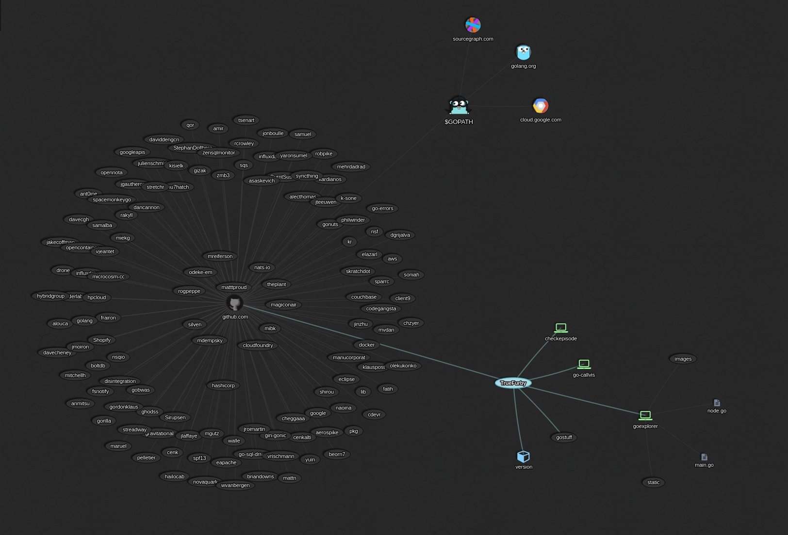

[](https://gophers.slack.com/archives/goexplorer)
# Go Explorer 

**Go Explorer** is a tool to examine Go packages using interactive overview.



## Introduction

Purpose of this tool is to provide dynamic visualization of various examinations of Go packages like exploring $GOPATH, viewing dependencies of package or call graph of a program.

**This project is currently at very early stage of development!** :warning:

### How it works

It has web server that serves the API and web application that uses [vis.js](http://visjs.org/) for visualization inside `<canvas>`.

## Features

- [x] explore hierarchy of $GOPATH
- [ ] view dependencies of a package
- [ ] show call graph of a program


> did you find any bugs or have any suggestions? Feel free to open [new issue](https://github.com/TrueFurby/goexplorer/issues/new) or start discussion in our channel at slack

## Installation

#### Requirements

- [Go 1.7+](https://golang.org/dl/)

### Install

Use the following command to install:

```
go get -u github.com/TrueFurby/goexplorer
```

### Quick start

Start the web server using following commands:

```
cd $GOPATH/src/github.com/TrueFurby/goexplorer
goexplorer
```

and go to http://localhost:8888.

> run `goexplorer -h` for usage help

## Community

Join the [#goexplorer](https://gophers.slack.com/archives/goexplorer) channel at [gophers.slack.com](http://gophers.slack.com) (*not a member?* [send invitation](https://gophersinvite.herokuapp.com))
